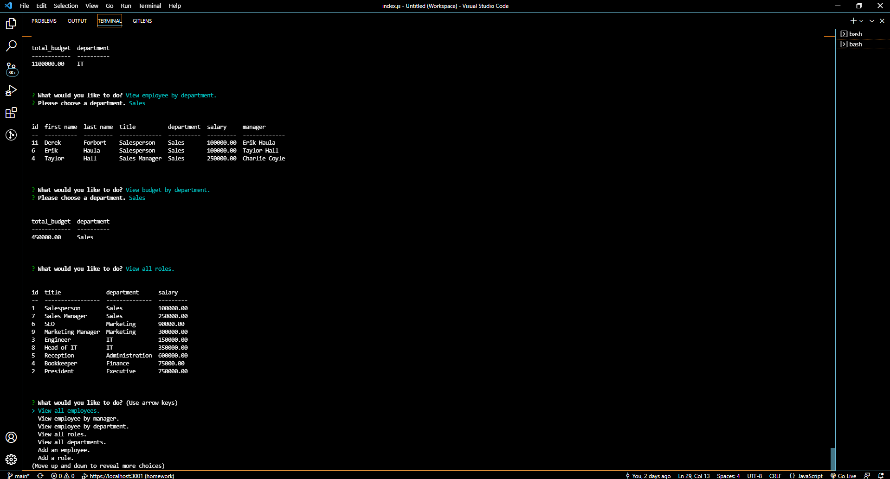

# SQL-Employee-Tracker
# Description:
A command-line application that manages a company's employee database, using Node.js, Inquirer, and MySQL.
## Table of Contents
* [Installation](#installation)
* [Usage](#usage)
* [Features](#features)
* [Technology](#technology)
* [License](#license)
* [Screenshot](#screenshot)
* [Repository](#repository-httpsgithubcomdpmurphy11sql-employee-tracker)
* [Demo Videos](#demo-video-1-httpsdpmurphy11githubiosql-employee-trackerassetssql-employee-tracker-video1webm)
* [Questions](#questions)
## Installation
  To install the project dependencies, run the following command:
  ```
  npm i
  ```
## Usage
  To run the program, enter the following command:
  ```
  node index.js
  ```
## Features
```md
WHEN the user start the application
THEN I am presented with the following options: view all departments, view all roles, view all employees, add a department, add a role, add an employee, update an employee role, view employess by manager, view employees by department, delete departments, delete roles, delete employees, and view total budget of a department 
WHEN the user chooses to view all departments
THEN the user is presented with a formatted table showing department names and department ids
WHEN the user chooses to view all roles
THEN the user is presented with the job title, role id, the department that role belongs to, and the salary for that role
WHEN the user chooses to view all employees
THEN the user is presented with a formatted table showing employee data, including employee ids, first names, last names, job titles, departments, salaries, and managers that the employees report to
WHEN the user chooses to add a department
THEN the user is prompted to enter the name of the department and that department is added to the database
WHEN the user chooses to add a role
THEN the user is prompted to enter the name, salary, and department for the role and that role is added to the database
WHEN the user chooses to add an employee
THEN the user is prompted to enter the employee’s first name, last name, role, and manager, and that employee is added to the database
WHEN the user chooses to update an employee role
THEN the user is prompted to select an employee to update and their new role and this information is updated in the database 
WHEN the user chooses to update an employee managers
THEN the user is prompted to select an employee to update and their new manager and this information is updated in the database 
WHEN the user chooses to update an employee role
THEN the user is prompted to select an employee to update and their new role and this information is updated in the database 
WHEN the user chooses to view employess by manager
THEN the user is prompted to select an employee as the manager and presented with a formatted table showing employee data, including employee ids, first names, last names, job titles, departments, salaries of the emplyees that report to that manager
WHEN the user chooses to view employees by department
THEN the user is prompted to select a department and presented with a formatted table showing employee data, including employee ids, first names, last names, job titles, departments, salaries of the emplyees that are in that department
WHEN the user chooses to delete a department
THEN the user is prompted to select the name of the department and that department is deleted from the database
WHEN the user chooses to delete a role
THEN the user is prompted to select the name of the role and that role is deleted from the database
WHEN the user chooses to delete an employee
THEN the user is prompted to select the name of the employee and that employee is deleted from the database
WHEN the user chooses to view total budget of a department
THEN the user is presented with a formatted table showing the combined salaries of all employees in that department
```
## Technology
```md
* VSCode terminal
* Node.js
* Template literals
* JavaScript modules
* Async Await
* Object Oriented Programming
* Realational database design
* Inquirer package
* MySQL2 package
* console.table package
```
### License
[](https://github.com/dpmurphy11/SQL-Employee-Tracker/blob/main/LICENSE)
### Screenshot

### Repository: <https://github.com/dpmurphy11/SQL-Employee-Tracker>
### Demo Video 1: <https://dpmurphy11.github.io/SQL-Employee-Tracker/assets/SQL-Employee-Tracker-video1.webm>
### Demo Video 2: <https://dpmurphy11.github.io/SQL-Employee-Tracker/assets/SQL-Emploee-Tracker-video2.webm>
### Questions
  If you have any questions about the repo, open an issue or contact me at dpmurphy_onsite@hotmail.com
  Visit my GitHub profile at [dpmurphy11](https://github.com/dpmurphy11/).# forked-sql-employee-tracker
